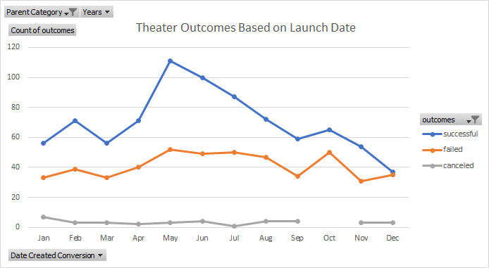
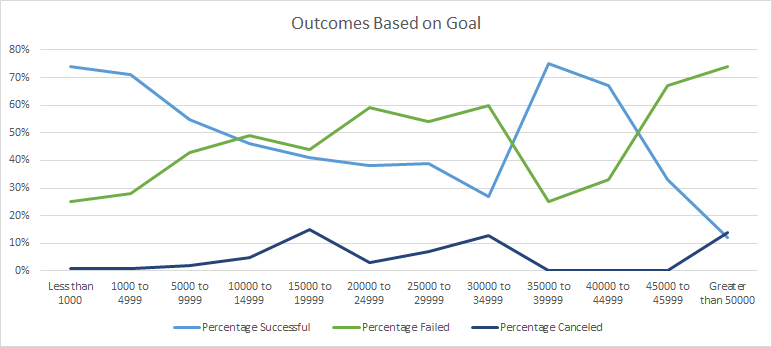

# Outcomes Based on Goals and Start Dates for Theater Kickstarters

## Overview of Project
Louise wanted to know how Kickstarter campaigns for other plays fared. First, we did an analysis based on which month the
campaigns started. Then, we did another analysis based on the amount of the fundraising goals.

### Purpose
Louise wanted to know what are some things she could do to increase the chances of her next Kickstarter to reach the 
fundraising goal. 

## Analysis and Challenges
To better understand the results, we produced a line graph from Pivot Tables for both outcomes by launch date and outcomes 
based on goals. This made it easier to visualize the data and able to present the results. The Pivot Tables allowed us to 
filter on different categories just see the theater Kickstarters.

### Analysis of Outcomes Based on Launch Date
Just looking at the line chart, you can easily tell that there is a high number of successful theater Kickstarter campaigns
that begin in the month of May. Additionally, there are very few more failed Kickstarter campaigns that started in May. While
it may be circumstantial, more research must be done to determine why this is happening. This chart can show when the most successful
campaigns start but we will have to look at more data. See below for the chart.

### Analysis of Outcomes Based on Goals
Intuitively, fundraisers with very low goal amounts tend to have higher chance of being successful. Not surprisingly, there is a downward
slope as the fundraising goal gets higher. However, there is a noticeable jump as the fund raising goal gets around $35,000. This could be
for a couple of reasons. One is that there are not very many examples of theater Kickstarter campaigns with high fundraising goals. Another
is that if the goal is high the theater play production is of high quality and could motivate people to pledge more to the fund. See below for the chart.

### Challenges and Difficulties Encountered
One challenge that we faces was that there were not a lot of Kickstarter campaigns with higher fundraising goals and it is hard to 
make conclusions based on small sample sizes.

## Results

- What are two conclusions you can draw about the Outcomes based on Launch Date?
One conlusion is that Kickstarter campaigns for plays that start in May have a higher chance of being succesful because there are much more
successful campaigns and around the same failed campaigns. Then, every month after that the amound of successful campaigns slowly decrease.
Another conclusion is that there is not nearly as much variation in the amount of failed theater kickstarter campaigns. This makes it easier
to make a judgement on how much success the campaigns have had in each month. For example, May and October have around the same amount of failed
campaigns but May has almost double the amount of successful campaigns. Judging by this alone, a theater campaign launching in May would 
have a much higher chance of being successful. 

- What can you conclude about the Outcomes based on Goals?
One conclusion we can make from this chart is that the lower the goal, the higher chance of success. While this might seem obvious, there
could be other variables as to why campaigns with lower goals are more successful. For example, we could look at the amount of donors and 
the mean donation. 

- What are some limitations of this dataset?
As I said earlier, a limitation of this dataset is that there are not a lot of examples of campaigns with high goals ($35,000 to $50,000). 
It is harder to see how successful campaigns with higher goals are since there is little information. Without more data, we cannot make a
good conclusion for these goal ranges. 

- What are some other possible tables and/or graphs that we could create?
We could do a line chart using average donation or amount of donors. This would give more clarity on why some campaigns succeed or not. 
